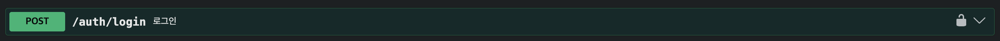

# Chwigo (취구)

자취생을 위한 공동구매 서비스 — 자취생들이 식재료/생필품을 함께 구매하고 나눠가집니다.

## 실행 방법

### 1. Docker Compose
도커가 켜져있어야합니다.

```bash
docker compose up -d --build
```

## 테스트 계정

테스트용 계정들입니다.

| 이메일 | 비밀번호 | 권한 |
|--------|----------|------|
| admin@chwigo.com | admin1234 | ROLE_ADMIN |
| user1@chwigo.com | user1234! | ROLE_USER |
| user2@chwigo.com | user1234! | ROLE_USER |
| user3@chwigo.com | user1234! | ROLE_USER |

## API 명세

### swagger
http://localhost:8080/swagger-ui/index.html

### 로그인 및 access token 부여




로그인 수행후 accessToken 을 Authorize 헤더에 넣어야합니다.
